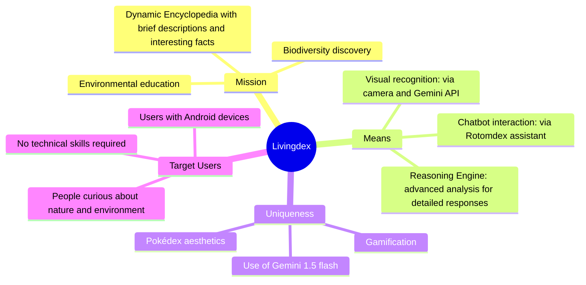
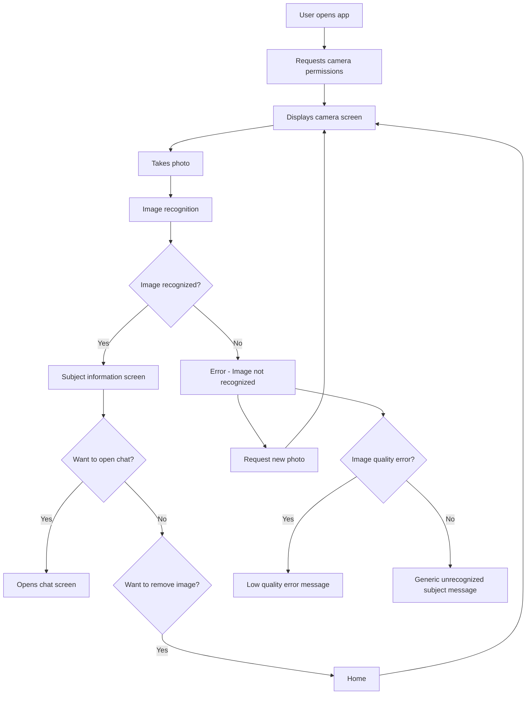
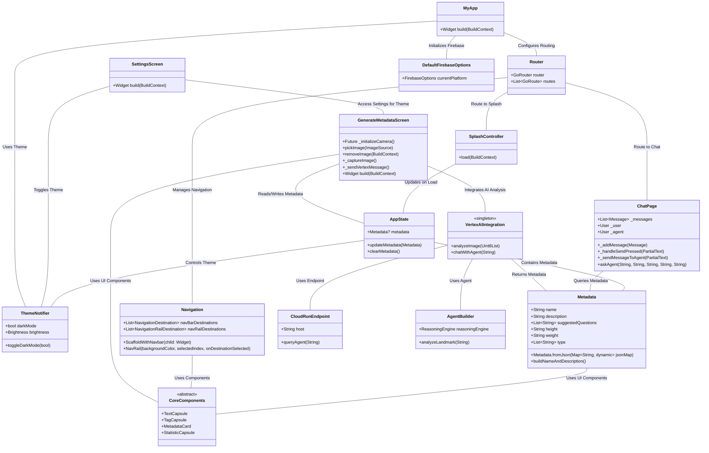
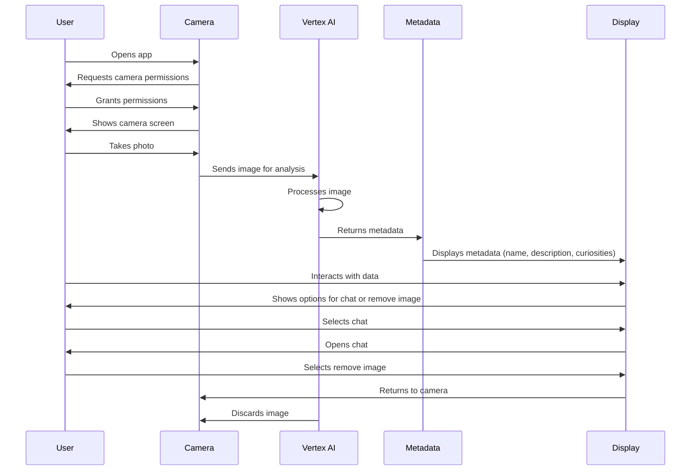

# Functional Analysis of Livingdex
## Project Map

## Project Objective
Livingdex is a personal project created to satisfy people's curiosity about the animals and plants they encounter. The app allows users to take a photo through the application, identify the living being in the frame, and obtain detailed information (name, weight, height, description enriched with curiosities). Additionally, users can interact with a chatbot for further exploration.  
Livingdex is designed to encourage people to look around with a fresh perspective on the environment, using an interface that recalls the aesthetics of a Pokédex, enhanced with features like dark mode. The captured image is displayed to the user during processing but is not saved to device storage and is discarded immediately after analysis.
## User Activity Flow
The activity flow in the app shows how the user interacts with the system in various steps. The user starts by opening the app and follows a series of actions to take a photo, receive results, and interact with the chatbot.

## Main Stakeholders

- **End users**: People curious to discover and learn more about animals and plants, primarily Android device owners.
- **Companies**: Potentially, to present the project as part of the portfolio.
---

## Target Users

Users who will use the app have Android devices. No particular technical skills are required, as the app is simple and intuitive. The user opens the app, takes a photo, and obtains information about the identified subject, with the option to chat with the chatbot for further details.

---

## **Main Features**

1. **Visual Recognition**  
    Take a photo of an animal or plant and get detailed information thanks to integration with Gemini 1.5 Flash.
    
2. **Pokédex-Themed Interface**  
    The UI is inspired by the Pokédex design, with icons, appbar, and images to make the user feel like they're using a real Pokédex.
    
3. **Integrated Chatbot**  
    Chat with Rotomdex, a virtual assistant that helps you with additional questions about the identified living being. Information comes from English Wikipedia, thanks to the Google "Reasoning Engine" agent.
    
4. **Dark Mode**  
    Customize the app's appearance for an optimal visual experience.
## UML Livingdex Application Structure

## **Non-functional Requirements**

1. **Performance**:  
    Response speed depends on internet connection and image quality. The Gemini 1.5 Flash API ensures good performance.
    
7. **Scalability**:  
    The app works even with low-quality images, as long as they are clearly framed.
    
8. **Security**:  
    No sensitive or personal data is collected, as the app does not require login. Captured images are displayed to the user during processing but are never saved and are deleted immediately after analysis.
    
9. **Request Support**:  
    The number of supported requests is presumably high but depends on the Gemini API capacity.

## **Operational Context**

- **Usage Locations**:  
    Primarily outdoors in natural contexts such as parks, mountains, and woods, where flora and fauna are abundant. However, it can also be used in urban contexts.
    
- **Operating Mode**:  
    The app works exclusively online, as it depends on the API for visual recognition.
    
- **Supported Devices**:  
    Supports Android devices. It is not currently tested on iOS devices.

## **Main Constraints**

1. **Limited Budget**:  
    Being a personal project, the budget is restricted. This limits access to more expensive APIs and technologies that could offer better performance or additional features.
    
2. **Available Technologies**:  
    Using more performant APIs could increase costs, so the choice was oriented toward more accessible solutions.
    
3. **Technical Skills**:  
    The project is developed in **Flutter**, but being self-taught, there are limitations in the level of experience and the features that can be implemented, which may affect development time.

## Main Workflows
4. **App Launch**:  
   Upon opening, a loading **splash screen** is shown with the app icon.
5. **Photo Acquisition**:  
   The user grants camera permission and views the camera **preview** with zoom and focus options.
6. **Photo Capture**:  
   The user presses the capture button and the image is transferred to a new screen.
7. **Data Display**:  
   The image is shown in a **card**. Below, there's another **card** with the name (common and scientific), average weight and height, and a description.
8. **Button Interaction**:  
   Two buttons at the bottom allow you to:
   - **Remove the image** (to take a new photo),
   - **Tell me more** (to interact with the Rotomdex chatbot).
9. **Dark Mode**:  
   The user can activate dark mode from **settings** (gear icon).

