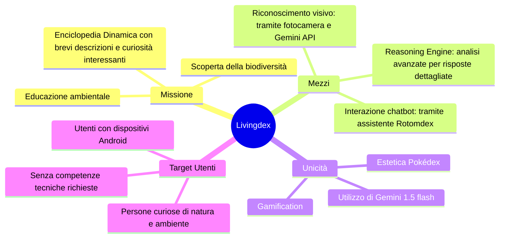
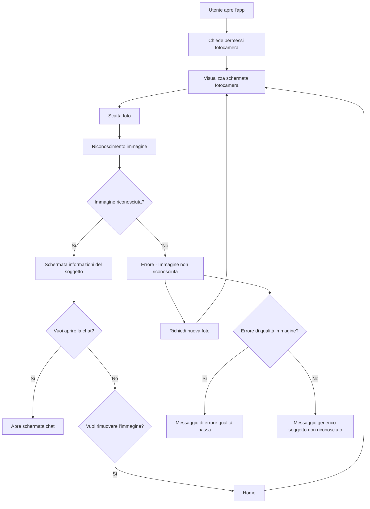
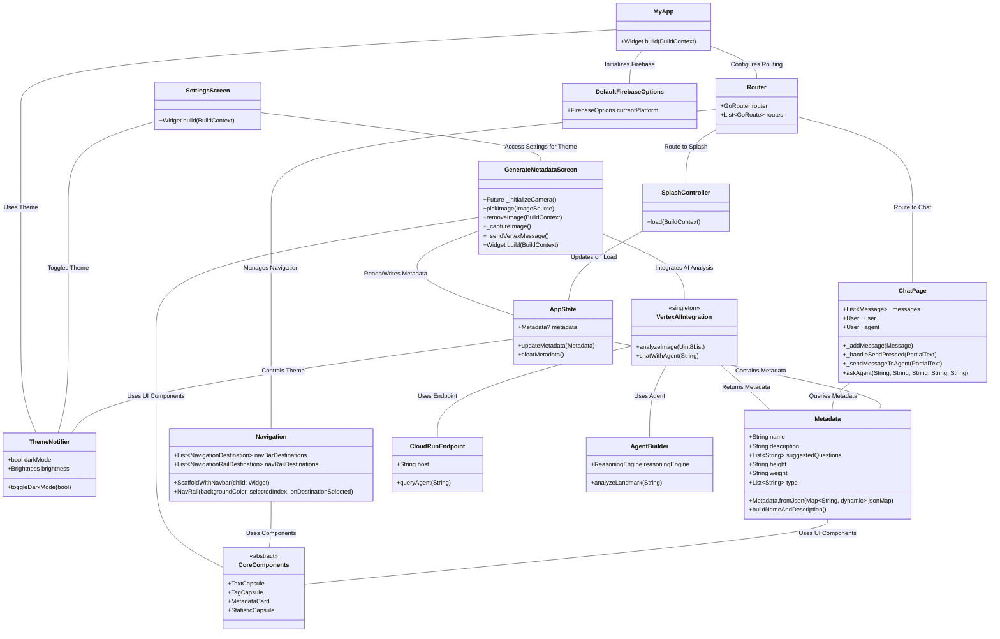
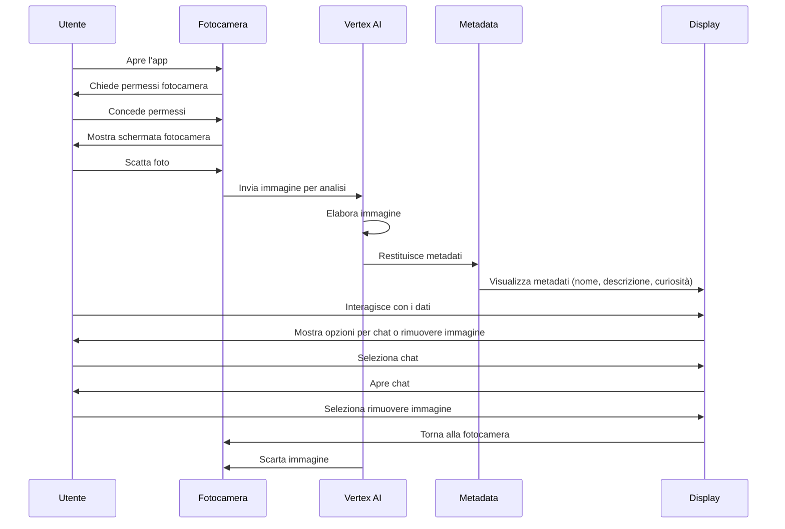

# Analisi Funzionale di Livingdex
## Mappa del progetto

## Obiettivo del progetto
Livingdex è un progetto personale creato per soddisfare la curiosità delle persone riguardo agli animali e alle piante che incontrano. L'app consente di scattare una foto tramite l'applicazione, identificare l'essere vivente inquadrato e ottenere informazioni dettagliate (nome, peso, altezza, descrizione arricchita con curiosità). Inoltre, gli utenti possono interagire con un chatbot per approfondire ulteriormente.  
Livingdex è pensata per invogliare le persone a guardarsi intorno con uno sguardo nuovo sull’ambiente, utilizzando un’interfaccia che richiama l’estetica di un Pokédex, arricchita da funzionalità come la modalità scura. L'immagine scattata viene visualizzata dall'utente durante l'elaborazione, ma non viene salvata nell'archiviazione del dispositivo e viene scartata immediatamente dopo l'analisi.
## Flusso delle Attività dell'Utente
Il flusso delle attività nell'app mostra come l'utente interagisce con il sistema in vari passaggi. L'utente inizia con l'apertura dell'app e segue una serie di azioni per scattare una foto, ricevere i risultati e interagire con il chatbot.

## Stakeholder principali

- **Utenti finali**: Persone curiose di scoprire e imparare di più su animali e piante, principalmente possessori di dispositivi Android.
- **Aziende**: Eventualmente, per presentare il progetto come parte del portfolio.
---

## Utenti target

Gli utenti che utilizzeranno l'app sono in possesso di dispositivi Android. Non è necessario possedere competenze tecniche particolari, poiché l'app è semplice e intuitiva. L'utente apre l'app, scatta una foto e ottiene informazioni sul soggetto identificato, con la possibilità di chattare con il chatbot per ulteriori dettagli.

---

## **Funzionalità principali**

1. **Riconoscimento Visivo**  
    Scatta una foto a un animale o una pianta e ottieni informazioni dettagliate grazie all'integrazione con Gemini 1.5 Flash.
    
2. **Interfaccia a Tema Pokédex**  
    La UI è ispirata al design del Pokédex, con icone, appbar e immagini per far sentire l'utente come se stesse usando un vero Pokédex.
    
3. **Chatbot Integrato**  
    Chatta con Rotomdex, un assistente virtuale che ti aiuterà con domande aggiuntive sull’essere vivente identificato. Le informazioni provengono dalla Wikipedia inglese, grazie all'agente Google "Reasoning Engine".
    
4. **Modalità Scura**  
    Personalizza l'aspetto dell'app per un'esperienza visiva ottimale.
## UML Struttura Applicazione Livingdex

## **Requisiti non funzionali**

1. **Performance**:  
    La velocità di risposta dipende dalla connessione internet e dalla qualità dell'immagine. L’API Gemini 1.5 Flash garantisce una buona performance.
    
7. **Scalabilità**:  
    L'app funziona anche con immagini di bassa qualità, ma chiaramente inquadrate.
    
8. **Sicurezza**:  
    Non vengono raccolti dati sensibili o personali, poiché l'app non richiede login. Le immagini scattate vengono visualizzate dall'utente durante l'elaborazione, ma non vengono mai salvate e vengono eliminate subito dopo l'analisi.
    
9. **Supporto per le richieste**:  
    Il numero di richieste supportate è presumibilmente elevato, ma dipende dalla capacità dell'API Gemini.

## **Contesto operativo**

- **Luoghi di utilizzo**:  
    Principalmente all'aperto in contesti naturali come parchi, montagne e boschi, dove la flora e fauna sono abbondanti. Tuttavia, può essere usata anche in contesti urbani.
    
- **Modalità operativa**:  
    L'app funziona esclusivamente online, poiché dipende dall'API per il riconoscimento visivo.
    
- **Dispositivi supportati**:  
    Supporta dispositivi Android. Non è attualmente testata su dispositivi iOS.

## **Vincoli principali**

1. **Budget Limitato**:  
    Essendo un progetto personale, il budget è ristretto. Questo limita l’accesso a API e tecnologie più costose che potrebbero offrire performance migliori o funzionalità aggiuntive.
    
2. **Tecnologie Disponibili**:  
    L'uso di API più performanti potrebbe aumentare i costi, quindi la scelta è stata orientata verso soluzioni più accessibili.
    
3. **Competenze Tecniche**:  
    Il progetto è sviluppato in **Flutter**, ma essendo autodidatta, ci sono delle limitazioni nel livello di esperienza e nelle funzionalità che si possono implementare, il che potrebbe influire sul tempo di sviluppo.

## Flussi di lavoro principali
4. **Avvio dell'app**:  
   All'apertura, viene mostrato uno **splash screen** di caricamento con l'icona dell'app.
5. **Acquisizione della Foto**:  
   L'utente concede il permesso per la fotocamera, visualizza la **preview** della fotocamera con opzioni di zoom e messa a fuoco.
6. **Cattura della Foto**:  
   L'utente preme il tasto di scatto e l'immagine viene trasferita in una nuova schermata.
7. **Visualizzazione dei Dati**:  
   L’immagine viene mostrata in una **card**. In basso, c'è un'altra **card** con il nome (comune e scientifico), il peso e l'altezza medi, e una descrizione.
8. **Interazione con i Pulsanti**:  
   Due pulsanti in basso permettono di:
   - **Rimuovere l'immagine** (per scattare una nuova foto),
   - **Dimmi di più** (per interagire con il chatbot Rotomdex).
9. **Modalità Scura**:  
   L'utente può attivare la modalità scura dalle **impostazioni** (icona ingranaggio).

